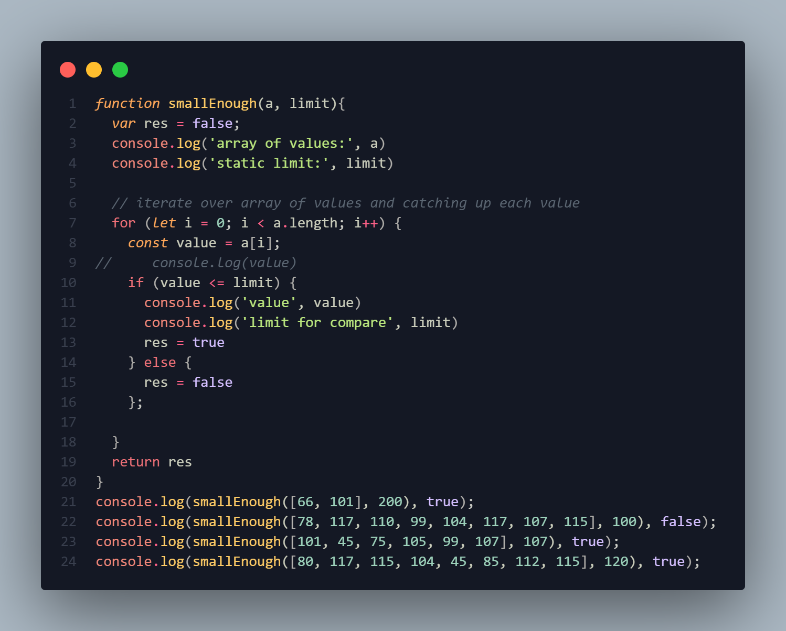
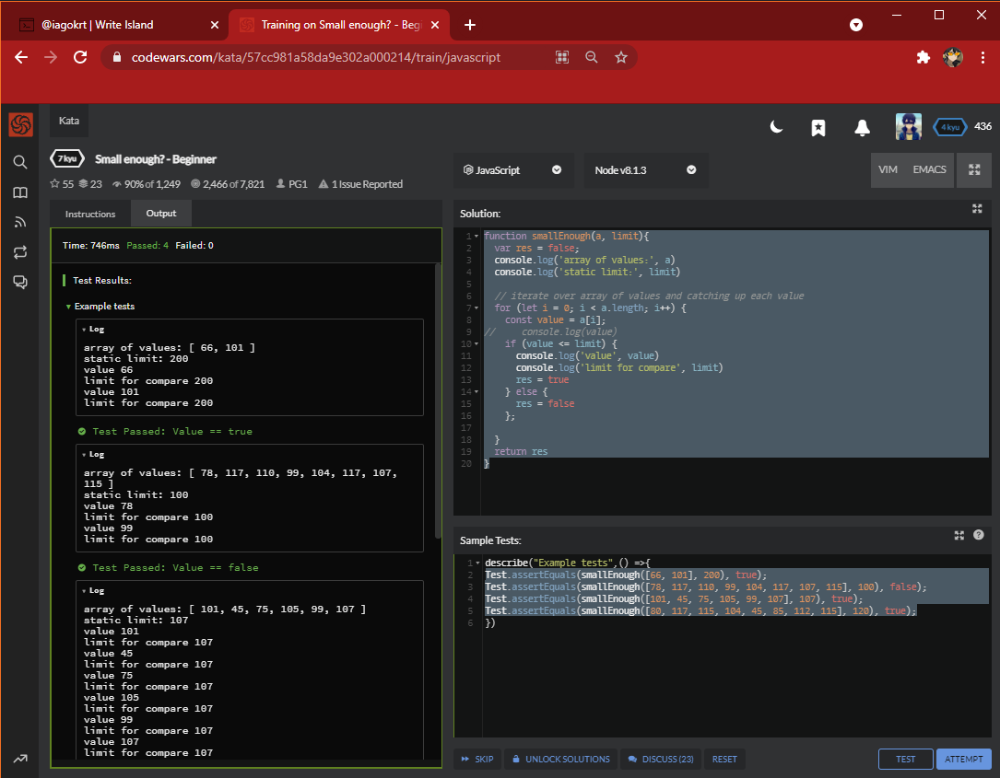
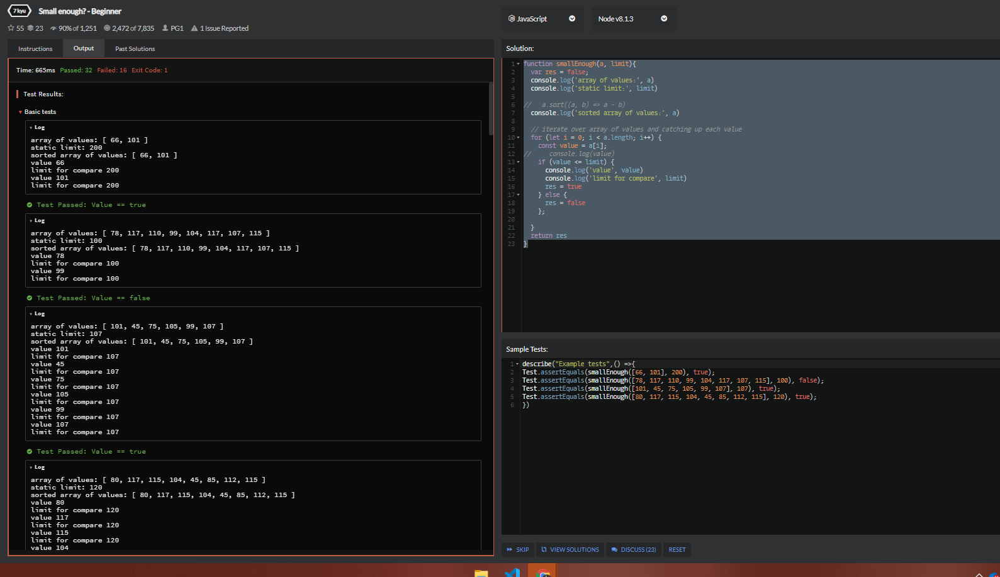
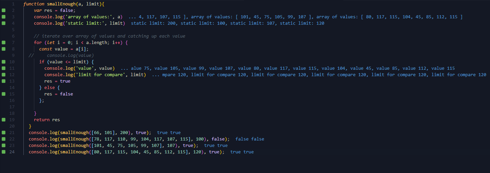
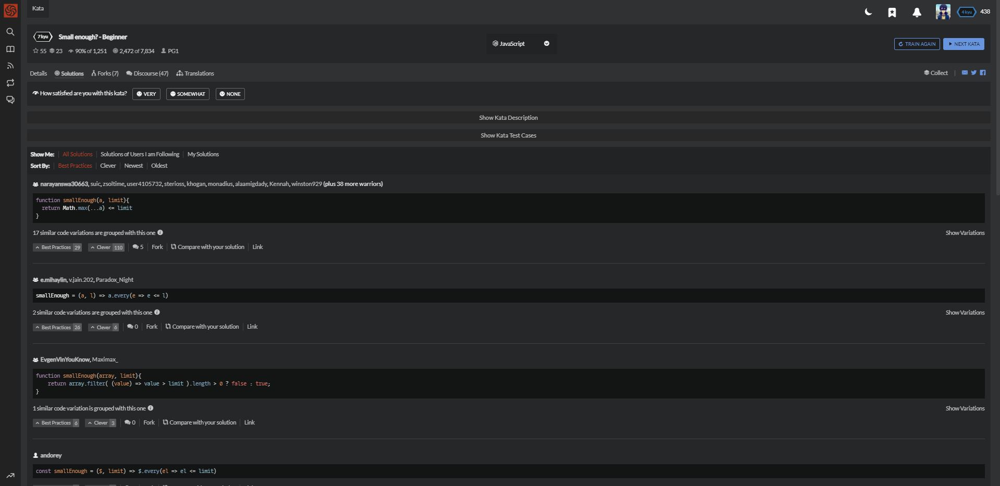

Coding is about pratice. like karate! 

Starting by now can be possible tough with all that coding patterns, frameworks, bundlers, layouts and all that good dev environment setups 
ee!

As programmers being able to deal with these tools is just cool. The stuff you learn about coding are not entirely necessary about it.

Keeping a sharp skill on a web framework requires you to know well the language which your code is being compiled.

``Therefore this situation needs to be studied in greater depth so that appropriate measures can be taken, being able to understand the logs on the applications and servers is one of the main perks of low-level programming studies.``
 
## code katas!

Katas are one way of keepin your coding skills sharp. https://www.codewars.com/
You can start as highers 'kyu' on many programming languages as choices

Here is a example where i coded a solution for one of many problems on the platform that are actually kinda easy if you can understand what are the `Instructions`

So this first solution is implemented on vscode which is a code editor. Web developers kinda like it and use it for building code in general.

We could also use the on build-in code editor on the codewars with some sample tests setup...

If something does not work you should see the errors on the codewars response, e.g.: 

debug locally with vscode extensions such as Quokkajs

After the tests sample are a few others on the local editor and you are now ready to submit the full kata through the final tests!

## You should see others users way of coding the great variety of solutions for the problem.

## Which is a fantastic featured-way of learning subjects about your favorites programming languages.