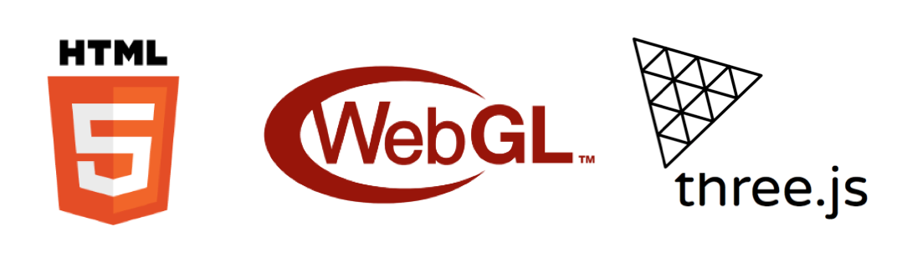
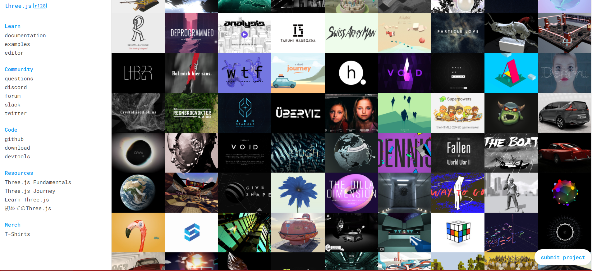

Starting just now with webgl? No problem.

the standard way of doing 3d? it does not exists!

Try to keep small goes on the big run about learning new stuff on the process of development

if you want to compose cool things on web you should know basics on HTML and CSS.

Once you understand you can jump up on some javascripts.

Programming languages share a lot of concepts and are here presented as simplied way of explanation about these general subjects.

### webgl and html

first we talk about how to connect webgl to html.

- we can use a canvas HTML5 element to connect it to our 3d solution.

- Threejs itself is a way of writing webGL as a more readable approach. 

Concepts that arounds a scene can have drawings of **scenegraphs** to represent what should be seem on stage!

# Art of coding

once you connect your canvas with threejs the whole 3d world is enabled on your browser.
This can be used for create games or immersive cool experiences.

# React-three-fiber is a React renderer for three.js.

### Represents the optimized abstraction for coding with webGL and three, in a declarative way on top of react ecossystem.

The conclusion here is that while using three on top of react there can be several benefits, e.g.: drei helpers collection, abstractions and re-usability.

- [React Three Fiber Documentation](https://docs.pmnd.rs/react-three-fiber/ "React three fiber docs")
- [React Three Drei Examples](https://docs.pmnd.rs/drei/introduction "Drei's library")
- [React Sprint Animations](https://docs.pmnd.rs/react-spring/introduction "React Spring")

## Example
<iframe src="https://codesandbox.io/embed/r3flex-forked-3wo1n?fontsize=14&hidenavigation=1&theme=dark"
     style="width:100%; height:500px; border:0; border-radius: 4px; overflow:hidden;"
     title="r3flex (forked)"
     allow="accelerometer; ambient-light-sensor; camera; encrypted-media; geolocation; gyroscope; hid; microphone; midi; payment; usb; vr; xr-spatial-tracking"
     sandbox="allow-forms allow-modals allow-popups allow-presentation allow-same-origin allow-scripts"
   ></iframe>

# where to start?

All the fundamentals about this programms are at the definitions of concepts like:

**Primitives** / **Scenegraph** / **Materials** / **Textures**

**Lights** / **Cameras** / **Helpers** / **Model Load**

**Audio, Processing** /**Post Processing Effects** / **Shaders**

**State management** / **Animations**

> learn more about core: [Threejs Fundamentals](https://threejsfundamentals.org/)

> cool effects with react-three ecosystem: [drcmda sandboxes](https://codesandbox.io/u/drcmda)  

