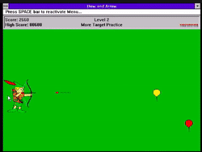
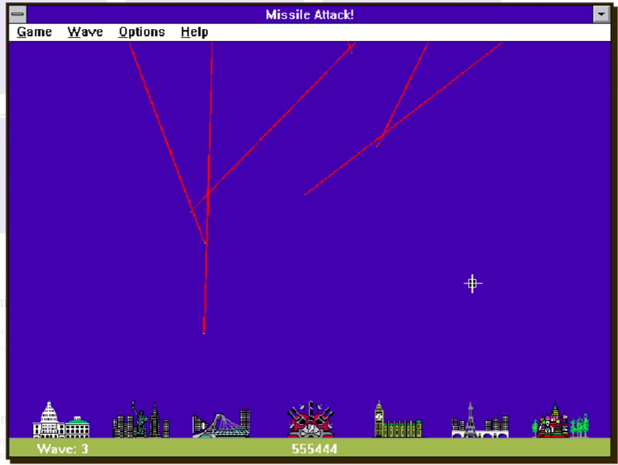

Puts! Qual o nome mesmo?

Exatamente essa sensação que me fez buscar alguns jogos que eu curtia demais quando era pequeno e acabei encontrando alguns:

- Joguinho do Robin Hood (Bow and Arrow 1992)

Link para jogar: [Jogar Agora!](https://classicreload.com/win3x-bow-and-arrow.html)

O jogo consiste em basicamente mover o robin hood pra cima e pra baixo e acertar os alvos, fantástico!

---

- Joguinho de proteger a cidade (Missile Attack Windows 3.x 1992)

O jogo consiste em proteger a cidade de ser destruída, existiram outras versões desse game para ATARI antes dessa versão de 92 que eu joguei, mas pra mim esse jogo era fenomenal!

