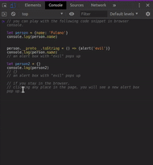
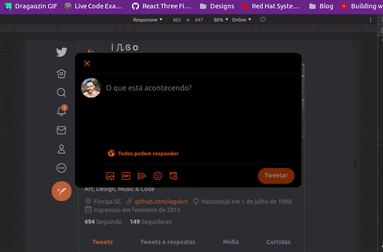

H3LL0 W0RLD

---

Para o post de hoje teremos bastante foco no contexto de **CyberSecurity**
Então prepara um *cafézão do bão* e bora entender esse conceito aí chamado **Prototype Pollution** !

---

## Definição

Aqui vai uma breve definição do que é o Prototype Pollution, escrita por **Changhui Xu**, um [desenvolvedor](https://github.com/changhuixu "changhuixu").

> _"**Prototype Pollution, as the name suggests, is about polluting the prototype of a base object which can sometimes lead to arbitrary code execution.**"_

## Attack

O ~~queridinho~~ **J**ava**S**cript é frequentemente descrito como uma **linguagem baseada em protótipo**, essa definição pode ser também chamada de programação baseada em instância ou programação orientada a protótipo sem classe. [Se quiser aqui tem uma discussão sobre o assunto mais detalhadamente](https://qastack.com.br/programming/186244/what-does-it-mean-that-javascript-is-a-prototype-based-language)

Dessa forma, a propriedade ```__proto__``` de ```Object.prototype``` expõe o ```[[Prototype]]``` interno (do tipo objeto ou nulo) do objeto por meio do qual ele é acessado.

## Descobrindo sobre o js

Como mencionado também por [Changhui Xu](https://github.com/changhuixu "changhuixu") em seu artigo, existe uma má prática que pode ser fatal, a de sobrescrever essa propriedade que por padrão já está 'embutida', digamos assim, no javascript.

Se modificarmos o prototype de um object em um lugar, então o comportamento de todos objetos podem ser afetados através de toda aplicação.

> **A common undesired practice is overwriting the prototype of a default JavaScript object.**

Por exemplo nesse simples caso, o método .toString() será forjado um novo em cima. Sobrepondo informações antes já existentes..

```js
// É possível testar o uso desse script
// dentro do console de desenvolv. do navegador

let person = {name: 'Fulano'}

console.log(person.name)
// Fulano

person.__proto__.toString = () => {alert('evil')}
// aqui o método foi 'hijacked'

console.log(person.name)
// uma caixa com a função do alert() irá aparecer no lugar
// "evil"

let person2 = {}
console.log(person2)
// {}
// uma caixa com a função do alert() irá aparecer no lugar
// "evil"

/* se você seguir no navegador e clicar em qualquer lugar da página
verá um novo alerta abrindo repetidamente */
```

[view raw](https://gist.githubusercontent.com/changhuixu/5602bce32586a91c268a4a202d3ee9c8/raw/78ccc82705ef49d0be239b0c13ae1e6540fc8c25/prototype-pollution-1.ts)

_Dessa forma observamos a diferença entre os dois retornos dos console.._


E também o comportamento do object depois de estar sendo *polluted*



---

## Contextualizando

É mais comum utilizar uma função que sirva para iterar(um popular **for loop** digamos assim) passando pelas propriedades do objeto.

O exemplo abaixo, é de uma função que serve exatamente para combinar mesclando as propriedades de dois objetos distintos.

> Essa estratégia de ataque é um desafio que foi descrito em uma conferência chamada Nullcon HackIM, nesse [post](https://blog.0daylabs.com/2019/02/15/prototype-pollution-javascript/) é mais abrangentemente abordado o assunto...

```js
const isObject = obj => obj && obj.constructor && obj.constructor === Object;
function merge(dest, src) {
    for (var attr in src) {
        if (isObject(dest[attr]) && isObject(src[attr])) {
            merge(dest[attr], src[attr]);
        } else {
            dest[attr] = src[attr];
        }
    }
    return dest
}

// Normal execution
var a = {}
var b = JSON.parse(`{"admin": false}`)
merge(a,b)
// {admin: false}

// Attack
var c = {}
var d = JSON.parse(`{"__proto__": {"admin": true}}`)
merge(c,d)
// {admin: true}
c
// {admin: true}
```

[view raw](https://gist.githubusercontent.com/changhuixu/0d4a12a4f72db2cf48a21157ba8a2997/raw/86351a467c1b518c2f4e26a4dee41a57c700af90/vulerable-merge.ts)

Aos pen-testers profissionais cabe a missão de provar uma possível vulnerabilidade, seja qual for a categoria.

Nesse caso, ao passar um retorno malicioso em JSON para o servidor node.js,

a lógica de autorizar usuários é transgredida, deixando a propriedade admin de uma forma alterada.

Neste caso também é possível pensar na hipótese de que o ataque poderia culminar numa **Remote Code Execution** (RCE).

## Stay Safe

Existem diversas formas de ~~lidar com essa treta~~ como um bom desenvolvedor estar atento para os diversos cenários existentes...

- Congelar o objeto de modo que não possa ser mais alterado Object.freeze()

- Camada de validação dos inputs(entradas) de formato JSON *uma das minhas libs favoritas pra isso é o **Yup**

- Cuidado ao fazer esse tipo de mesclagens recursivas, evitando assim esbarrar em propriedades que sejam sensíveis

- Usar da criação de objetos sem a necessidade de Prototype

- Utilização de Map, que veio já com o ES6. Isso porque o Map vai iterar mas também armazenar as informações com uma estrutura de chave-valor. Não é suscetível a ~~dar merda~~ pollution attacks.

- Entre outras diversas opções de boas práticas :)

[Documento completo sobre attacks desse naipe](https://github.com/HoLyVieR/prototype-pollution-nsec18/blob/master/paper/JavaScript_prototype_pollution_attack_in_NodeJS.pdf)

See ya'
